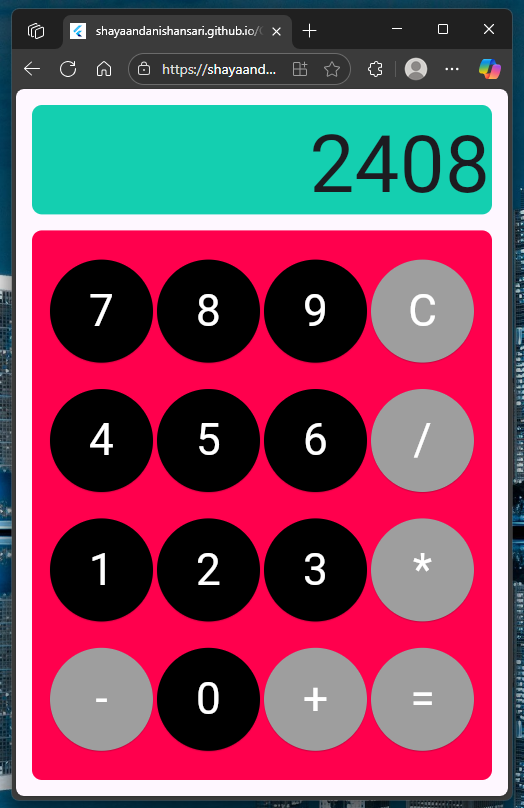

# Calculator App (Flutter)

A simple Flutter calculator app built for practice with Flutter layouts, state management, and GitHub Pages deployment.  
This project was made as a learning exercise and also deployed as a live demo using GitHub Pages.

## Features
- Responsive 4x4 calculator layout
- Basic operations: addition, subtraction, multiplication, division
- Clear (`C`) button
- Equals (`=`) button with expression evaluation using `math_expressions`
- Display box with scroll support for long expressions
- Responsive UI with `Expanded` and flex ratios (1/5 top display, 4/5 keypad)
- Deployed to GitHub Pages with Flutter web + peanut

## Screenshot

## Live Demo
[Calculator on GitHub Pages](https://shayaandanishansari.github.io/CalculatorFlutterAppDemoShayaan/)
